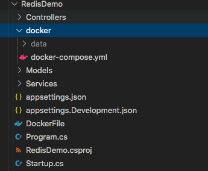

# Project Template - Redis Cluster + .Net Core 3.1 API + Docker

> This is a project template that saves your time create redis cluster in docker with a dotnet core app to consume from scratch. All you need to do is using docker-compose up and you already have 1 master + 3 slaves redis cluster.

Read full medium article https://medium.com/@mrkevin.wang/create-redis-cluster-docker-net-core-3-1-api-for-distributed-caching-ff0ba1673231

**Pre-request**

- Redis [Bitnami Redis](https://github.com/bitnami/bitnami-docker-redis)
- Docker
- .Net Core 3.1 ([.Net Core 3.1 sdk - docker](https://hub.docker.com/_/microsoft-dotnet-core-sdk))
- [ServiceStack.Redis](https://github.com/ServiceStack/ServiceStack.Redis)

## Table of Contents

- [Features](#features)
- [Installation](#installation)
- [Usage](#usage)
- [Support](#support)
- [License](#license)

---

## Features

> This is a development project template, it is NOT production ready. It only kickstarting your project so that you don't need to build from scratch.

- Pre-built and configured redis cluster in docker
- Pre-built a sample web API in .net core 3.1
- The sample web API is built with DockerFile and runs in docker
- Easy to scale redis with n-masters & n-slaves in docker
- Built in generic cache client using ServiceStack.Redis

---

## Installation

- Using `dotnet new -i <package>` to install the project template from nuget [Superwalnut.RedisClusterTemplate](https://www.nuget.org/packages/Superwalnut.RedisClusterTemplate)

```shell
$ dotnet new -i Superwalnut.RedisClusterTemplate
```

You should see 'Redis .Net Core Template' in your template list by `dotnet new -l`


- Using `dotnet new redis-dotnet-core -n <your-project-name>` to create a project with your own project name using this template

```shell
$ dotnet new redis-dotnet-core -n RedisDemo -o RedisDemo
```

This creates a project in folder `RedisDemo`



---

### Usage

- Default - 1 master + 1 slave + 1 api

> Go to the <project-folder>/docker, you will see `docker-compose.yml` file, this is where you can run

```shell
$ docker-compose up --build
```

- Swarm Mode - 1 master + 3 slaves + 1 api

> Run `docker-compose` with compatibility mode, it will apply preset `deploy` to run docker swarm mode 

```json
    deploy:
      replicas: 3
```

```shell
$ docker-compose --compatibility up --build
```

- Advanced - n-Master + n-Slaves + api

> To run n number of masters and slaves, you will need to configure a couple of things in `docker-compose.yml`

Configure connection strings in api container, add n-number of master and n-number of slaves connection strings

```json
    - Redis__0=docker_redis-master_1:6379
    - Redis__1=docker_redis-replica_1:6379
    - Redis__2=docker_redis-replica_2:6379
    - Redis__3=docker_redis-replica_3:6379
```

Add or configure `deploy` section to the number you wanted

```json
    deploy:
    replicas: 3
```

---

## Documentation

- TODO

---

## Support

Reach out to me at one of the following places!

- [Follow me @ Github](https://github.com/superwalnut)

- [Twitter](https://twitter.com/superwalnuts)

- [](https://ko-fi.com/Z8Z61I9HB)

---

## License

[](http://badges.mit-license.org)

- **[MIT license](http://opensource.org/licenses/mit-license.php)**

-------

## Reference

- docker stop all

ocker stop $(docker ps -a -q)
docker rm $(docker ps -a -q)

- run command
docker-compose up --detach --scale redis-master=1 --scale redis-replica=3

docker-compose --compatibility up --build -p redis

- pack the project template
dotnet pack

dotnet build -c Release

- install template

dotnet new -i <package>

- create project

dotnet new redis-dotnet-core -n MyProject --force

- stop docker 
docker ps -q | xargs -L1 docker stop

- start docker
open --background -a Docker


- generate dev-cert ssl
dotnet dev-certs https --clean

dotnet dev-certs https -ep ${HOME}/.aspnet/https/aspnetapp.pfx -p password

dotnet dev-certs https --trust